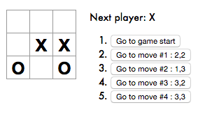

This project follows the Tic Tac Toe tutorial at the [Reactjs website](https://reactjs.org/tutorial/tutorial.html).

Much of the code for the tutorial is similar to as seen on the above webpage with few formatting mismatches.

Here I share my solutions to the suggested improvements to the Tic Tac Toe at the end of the tutorial.

Each commit corresponds to each task in order so that anyone can easily diff the specific changes for a particular task.


## Extras

##### 1. Display the location for each move in the format (col, row) in the move history list.

  * Here's the expected output based on my interpretation of the task :

  

  * The task is quite straightforward to implement. Each history element now stores ```picked``` which stores the index (0-8) of the clicked square.
  * In the ```Game``` class, we initialize the first state with picked as ```null```.
  ```javascript
  class Game extends React.Component {

    constructor(props) {
      super(props);
      this.state = {
        history: [{
          squares: Array(9).fill(null),
          picked: null,                                 <--
        }],
        stepNumber: 0,
        xIsNext: true,
      };
    }
  ```

  * Next, on every click we want to store the new state by saving the current squares information in it's ```history``` array.
  * We append the ```picked``` information to the ```history``` array which is nothing but the effective index of clicked square in the ```squares``` array.
  ```javascript
  handleClick(i) {
    const history = this.state.history.slice(0, this.state.stepNumber + 1);
    const current = history[history.length - 1];
    const squares = current.squares.slice();
    if(squares[i] || calculateWinner(squares))
      return;

    squares[i] = this.state.xIsNext ? 'X' : 'O';
    this.setState({ history: history.concat([{squares: squares, picked: i}]) ,   <--
                    stepNumber: history.length,
                    xIsNext: !this.state.xIsNext,
                  });
  }
  ```
  * Last step is to show the position of the clicked element with every move in ```col,row``` format.
  * From the index, we can get the col number as ```step.picked%3+1```
  * From the index, we can get the row number as ```Math.floor(step.picked/3)+1```
  * We now update the render function of the ```Game``` class to change the ```desc``` accordingly.
  ```javascript
    render() {

      const history = this.state.history;
      const current = history[this.state.stepNumber];
      const winner = calculateWinner(current.squares);

      const moves = history.map( (step,move) => {
          const desc = move ? 'Go to move #' + move + ' : ' +
           (step.picked%3+1) + ',' + (Math.floor(step.picked/3)+1)   <--
                            : 'Go to game start' ;
          return (
      ...
  ```


##### 2. Bold the currently selected item in the move list.


##### 3.  Rewrite Board to use two loops to make the squares instead of hardcoding them.
##### 4. Add a toggle button that lets you sort the moves in either ascending or descending order.
##### 5. When someone wins, highlight the three squares that caused the win.
##### 6. When no one wins, display a message about the result being a draw.
