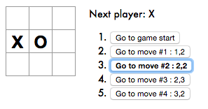
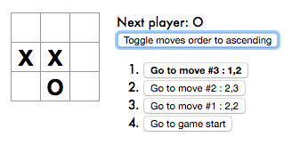
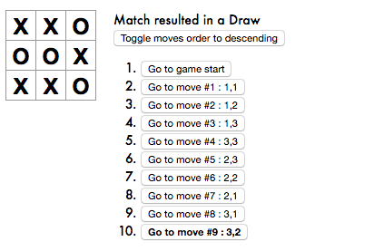

This project is extension of the Tic Tac Toe tutorial at the [ReactJS website](https://reactjs.org/tutorial/tutorial.html).

On the webpage, they have listed a number of suggested improvements to the Tic Tac Toe at the end of the tutorial. Here I share my solutions to those tasks. Much of the starter code for the tutorial is similar to as seen on the above webpage with few formatting mismatches.

I have tried to have each commit with format 'Completed task X' to correspond to each task in order so that anyone can easily diff the specific changes for a particular task.

I would love to have a discussion if you see any bugs or have a more optimized approach to any of the tasks.


## Tasks

##### 1. Display the location for each move in the format (col, row) in the move history list.

  * Here's the expected output based on my interpretation of the task :

  

  * The task is quite straightforward to implement. Each history element now stores ```picked``` which stores the index (0-8) of the clicked square.
  * In the ```Game``` class, we initialize the first state with picked as ```null```.
  ```javascript
  class Game extends React.Component {

    constructor(props) {
      super(props);
      this.state = {
        history: [{
          squares: Array(9).fill(null),
          picked: null,                                 <--
        }],
        stepNumber: 0,
        xIsNext: true,
      };
    }
  ```

  * Next, on every click we want to store the new state by saving the current squares information in it's ```history``` array.
  * We append the ```picked``` information to the ```history``` array which is nothing but the effective index of clicked square in the ```squares``` array.
  ```javascript
  handleClick(i) {
    const history = this.state.history.slice(0, this.state.stepNumber + 1);
    const current = history[history.length - 1];
    const squares = current.squares.slice();
    if(squares[i] || calculateWinner(squares))
      return;

    squares[i] = this.state.xIsNext ? 'X' : 'O';
    this.setState({ history: history.concat([{squares: squares, picked: i}]) ,   <--
                    stepNumber: history.length,
                    xIsNext: !this.state.xIsNext,
                  });
  }
  ```
  * Last step is to show the position of the clicked element with every move in ```col,row``` format.
  * From the index, we can get the col number as ```step.picked%3+1```
  * From the index, we can get the row number as ```Math.floor(step.picked/3)+1```
  * We now update the render function of the ```Game``` class to change the ```desc``` accordingly.
  ```javascript
    render() {

      const history = this.state.history;
      const current = history[this.state.stepNumber];
      const winner = calculateWinner(current.squares);

      const moves = history.map( (step,move) => {
          const desc = move ? 'Go to move #' + move + ' : ' +
           (step.picked%3+1) + ',' + (Math.floor(step.picked/3)+1)   <--
                            : 'Go to game start' ;
          return (
      ...
  ```

---

##### 2. Bold the currently selected item in the move list.
* We achieve this by simply toggling between a empty CSS class and a custom styled CSS class whenever a move is clicked.

  

* For this, we first need to add a new CSS class - ```bold``` which has it's ```font-weight``` property set as bold.
```css
.bold {
  font-weight: bold;
}
```

* Next, we create a ```formatClass``` variable which takes value 'bold' if the ```move``` value is equal to the current ```stepNumber```.
```javascript
render() {

  const history = this.state.history;
  const current = history[this.state.stepNumber];
  const winner = calculateWinner(current.squares);

  const moves = history.map( (step,move) => {
      const desc = move ? 'Go to move #' + move + ' : ' + (step.picked%3+1) + ',' +  (Math.floor(step.picked/3)+1)
                        : 'Go to game start' ;
      const formatClass = (move == this.state.stepNumber ? 'bold' : '');  <--
      return (
        <li key={move}>
          <button className={formatClass} onClick={ () => this.jumpTo(move, this.key) }>{desc}</button> <--
        </li>
      );
  });
```

---

##### 3.  Rewrite Board to use two loops to make the squares instead of hardcoding them.

* To make the squares dynamically, we first create individual squares for each row and store them in an array.
* An outer loop is used to pack each row inside a div with class `board-row`.

* All changes are restricted to inside of the render function of the `Board` class
```javascript
render() {

  let allSquares = []
  for (var row_n = 0; row_n < 3; row_n++) {
    let rowSquares = []
    for (var col_n = 0; col_n < 3; col_n++) {
      rowSquares.push( this.renderSquare(row_n*3+col_n) );
    }
    allSquares.push(<div className="board-row">{rowSquares}</div>);
  }

  return (
    <div>
      {allSquares}
    </div>
  );
}
```

---

##### 4. Add a toggle button that lets you sort the moves in either ascending or descending order.

* This one was a little tricky to figure out. I believe there are a number of ways to achieve this. I implemented what I think is the best solution - build the list of moves as before and reverse the sequence if the current selected order is descending.

  

* We first add a new property `movesAsc` to the constructor of the `Game` class. We initialize it to true.
```javascript
class Game extends React.Component {

  constructor(props) {
    super(props);
    this.state = {
      history: [{
        squares: Array(9).fill(null),
        picked: null,
      }],
      stepNumber: 0,
      xIsNext: true,
      movesAsc: true, <--
    };
  }
```

* Next, we update the render function of the Game class. Here we need to make the following 4 changes :
   1. Add a toggle button before the list of moves buttons.
   2. If the `movesAsc` in the current state is set to `false`, we reverse the order of the list of moves. _(for this, you need to change the moves variable type from const to let)_
   3. Based on the current `movesAsc` value, we change the text of the `toggleButton`.
   4. We register calling of function `toggleOrder()` through it's `onClick` property.

```javascript
render() {

  const history = this.state.history;
  const current = history[this.state.stepNumber];
  const winner = calculateWinner(current.squares);

  let moves = history.map( (step,move) => {
      const desc = move ? 'Go to move #' + move + ' : ' + (step.picked%3+1) + ',' +  (Math.floor(step.picked/3)+1)
                        : 'Go to game start' ;
      const formatClass = (move == this.state.stepNumber ? 'bold' : '');
      return (
        <li key={move}>
          <button className={formatClass} onClick={ () => this.jumpTo(move, this.key) }>{desc}</button>
        </li>
      );
  });
  if (this.state.movesAsc === false) {    <--
    moves = moves.reverse();              <--
  }                                       <--

  let status;
  if (winner) {
    status = 'Winner: ' + winner;
  }
  else {
    status = 'Next player: ' + (this.state.xIsNext ? 'X' : 'O') ;
  }

  const oppOrder = this.state.movesAsc ? 'descending' : 'ascending';                                          <--
  let toggleButton = <button onClick={ () => this.toggleOrder() }>Toggle moves order to {oppOrder}</button>   <--

  return (
    <div className="game">
      <div className="game-board">
        <Board
          squares={current.squares}
          onClick={ (i) => this.handleClick(i) }
        />
      </div>
      <div className="game-info">
        <div>{status}</div>
        <div>{toggleButton}</div>   <--
        <ol>{moves}</ol>
      </div>
    </div>
  );
}
}
```

* Next, we define the `onToggle()` funciton which simply updates the current state by toggling the boolean `movesAsc`.

```javascript
toggleOrder() {
  this.setState({ movesAsc: !this.state.movesAsc, });
}
```

---

##### 5. When someone wins, highlight the three squares that caused the win.

* For this, the idea is to have the information of the winning cells and passing down that information to where the squares are rendered. Here, if the index of the square is one of the winning cells, we add a new CSS class to its button. Here's the expected output:

  

* We first add a new class `highlighted` to the index.css file
```CSS
.highlighted {
  font-weight: bold;
  color: red;
}
```

* Next, we update the `calculateWinner()` function to return the indices of the three squares that cause the win when someone wins.
```javascript
  function calculateWinner(squares) {
  const lines = [
    [0, 1, 2],
    [3, 4, 5],
    [6, 7, 8],
    [0, 3, 6],
    [1, 4, 7],
    [2, 5, 8],
    [0, 4, 8],
    [2, 4, 6],
  ];

  for(let i=0; i<lines.length; i++) {
    const [a, b, c] = lines[i];
    if( squares[a] && squares[a]===squares[b] && squares[a]===squares[c] )
      return [ squares[a], a, b, c ];       <--
  }

  return null;
}
```

* We now modify the `render` function of the `Game` class to pass the WinnerCells information down to the `Board` class.
```javascript
  render() {

    const history = this.state.history;
    const current = history[this.state.stepNumber];
    const winnerInfo = calculateWinner(current.squares);                <--
    const winner = winnerInfo ? winnerInfo[0] : winnerInfo;             <--
    const winnerCells = winnerInfo ? winnerInfo.slice(1) : winnerInfo;  <--
    .
    .
    .
    return (
      <div className="game">
        <div className="game-board">
          <Board
            squares={current.squares}
            winnerCells={winnerCells}                                   <--
            onClick={ (i) => this.handleClick(i) }
          />
        </div>
        <div className="game-info">
          <div>{status}</div>
          <div>{toggleButton}</div>
          <ol>{moves}</ol>
        </div>
      </div>
    );
  }
}
```

* We are now in the `renderSquare` function of the `Board` class. Here, we use the `winnerCells` property to decide whether to append the `highlighted` class to a particular square or not.
* We pass this information down to the `Square` function through the `extraClass` property.
```javascript
  class Board extends React.Component {

    renderSquare(i) {
      let extraClassName = 'square';                                            <--
      if (this.props.winnerCells && this.props.winnerCells.indexOf(i) > -1 )    <--
          extraClassName = 'square highlighted';                                <--

      return (<Square
                key = {'sq_'+i}
                extraClass = {extraClassName}                                   <--
                value = {this.props.squares[i]}
                onClick = { () => this.props.onClick(i) }
              />);
    }
```

* Lastly, we use this `extraClass` property inside the `Square` function inside the className property.
```javascript

  function Square(props) {
    return (
      <button className={props.extraClass} onClick={props.onClick}>     <--
        { props.value }
      </button>
    );
  }
```

---

##### 6. When no one wins, display a message about the result being a draw.

* This is straightforward and built upon our existing code. Here is the expected output:

  

* Since we are calling the `calculateWinner` function in the `render` function of the `Game` class, it's the ideal place to check for a draw.
* Note that we return `['draw', null]` as an array so as to have it working with the previous tasks with minimal modifications.
```javascript
function calculateWinner(squares) {
  const lines = [
    [0, 1, 2],
    [3, 4, 5],
    [6, 7, 8],
    [0, 3, 6],
    [1, 4, 7],
    [2, 5, 8],
    [0, 4, 8],
    [2, 4, 6],
  ];

  for(let i=0; i<lines.length; i++) {
    const [a, b, c] = lines[i];
    if( squares[a] && squares[a]===squares[b] && squares[a]===squares[c] )
      return [ squares[a], a, b, c ];
  }

  for(let i=0; i<9; i++) {        <--
    if( squares[i] === null)      <--
        return null;              <--
  }                               <--

  return ['draw', null];          <--
}
```

* Next and the final step is to modify the `render` function of the `Game` class. Here, we simply set the `status` according to the return information from `calculateWinner` function.
```javascript
  render() {
    .
    .
    .
    let status;
    if (winner) {
      if(winner === 'draw')
          status = 'Match resulted in a draw';
      else
          status = 'Winner: ' + winner;
    }
    else {
      status = 'Next player: ' + (this.state.xIsNext ? 'X' : 'O') ;
    }
    .
    .
    .
```
